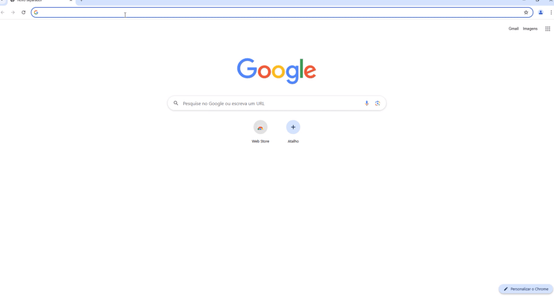
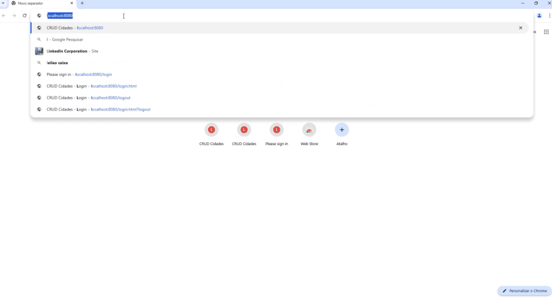

# SEGURANÇA COM SPRING BOOT

Este conteúdo faz parte do curso de Java Web da Pós-graduação - Especialização em Tecnologia Java da Universidade Federal do Paraná (UTFPR). Ministrado pelo Prof. Gabriel Costa, o conteúdo original pode ser encontrado no [GitHub](https://github.com/gabrielcostasilva/esp-java-2024).

---

## AUTENTICAÇÃO

**Autenticação** é o processo de validar a identidade de um usuário, confirmando se ele realmente é quem diz ser. Essa validação pode ser realizada de diversas formas, como por meio de senhas, biometria ou autenticação de dois fatores. A autenticação é um pré-requisito essencial para a **autorização**, que determina se um usuário tem permissão para acessar determinados recursos.

Para implementar a autenticação em um aplicativo Spring Boot, a maneira mais simples é adicionar a dependência `spring-boot-starter-security` ao seu arquivo `pom.xml`:

```xml
<dependency>
    <groupId>org.springframework.boot</groupId>
    <artifactId>spring-boot-starter-security</artifactId>
</dependency>
```

Ao iniciar a aplicação, o Spring Boot redireciona automaticamente para a tela de login. Você poderá visualizar no console do sistema a senha gerada automaticamente:

```
Using generated security password: d1a43d17-35d4-4e34-bdc9-e9881087a9ca
```



---

## AUTORIZAÇÃO

Após a autenticação, o próximo passo é configurar a **autorização**. Para isso, crie uma classe chamada `SecurityConfig` no pacote `br.edu.utfpr.cp.espjava.crudcidades`. Esta classe será responsável pelas configurações de segurança da sua aplicação.

### Configuração da Segurança

1. **Anotações de Configuração**: Utilize a anotação `@EnableWebSecurity` para ativar o suporte ao Spring Security. Além disso, a anotação `@Configuration` indica que a classe contém configurações que serão geridas pelo contexto do Spring.

2. **PasswordEncoder**: Para a codificação segura de senhas, implemente um método chamado `cifrador()`, anotado com `@Bean`. O Spring Security oferece implementações prontas, como `BCryptPasswordEncoder`, que é amplamente recomendado para o armazenamento seguro de senhas.

A implementação do método `cifrador()` é a seguinte:

```java
@Bean
public PasswordEncoder cifrador() {
    return new BCryptPasswordEncoder();
}
```

### Gerenciamento de Usuários

Agora, vamos associar usuários a seus papéis. Um papel (role) define um conjunto de permissões que um ou mais usuários possuem. Para simplificar, utilizaremos um armazenamento em memória para os usuários.

Crie um método `configure()` que retorna um objeto do tipo `InMemoryUserDetailsManager`. Neste exemplo, definiremos dois usuários:

```java
@Bean
public InMemoryUserDetailsManager configure() throws Exception {
    UserDetails usuarioSimples = User.withUsername("Maria")
            .password(cifrador().encode("teste123"))
            .roles("listar")
            .build();

    UserDetails usuarioAdmin = User.withUsername("Ana")
            .password(cifrador().encode("teste123"))
            .roles("admin")
            .build();

    return new InMemoryUserDetailsManager(usuarioSimples, usuarioAdmin);
}
```

### Definindo Autorizações

Para definir as autorizações, crie um método chamado `filter` com o seguinte formato:

```java
@Bean
protected SecurityFilterChain filter(HttpSecurity http) throws Exception {
    return http
            .authorizeHttpRequests(auth -> {
                auth.requestMatchers("/").hasAnyRole("listar", "admin");
                auth.requestMatchers("/criar", "/excluir", "/prepararAlterar", "/alterar").hasRole("admin");
                auth.anyRequest().denyAll();
            })
            .csrf(AbstractHttpConfigurer::disable)
            .formLogin(form -> form.loginPage("/login").permitAll())
            .logout(LogoutConfigurer::permitAll)
            .build();
}
```

Neste método, você define as regras de acesso:

- **Acesso por Papel**: Utilize `requestMatchers` para mapear URLs específicas a papéis. Por exemplo, a URL raiz pode ser acessada por usuários com papéis `listar` ou `admin`.

- **Negação de Acesso**: Use `anyRequest().denyAll()` para garantir que qualquer URL não explicitamente definida seja inacessível.

- **Acesso ao Login**: Permita que todos acessem a página de login com `formLogin().permitAll()`.

### Código Completo

Aqui está a implementação completa da configuração de segurança:

```java
package br.edu.utfpr.cp.espjava.crudcidades;

import org.springframework.context.annotation.Bean;
import org.springframework.context.annotation.Configuration;
import org.springframework.security.config.annotation.web.builders.HttpSecurity;
import org.springframework.security.config.annotation.web.configuration.EnableWebSecurity;
import org.springframework.security.config.annotation.web.configurers.AbstractHttpConfigurer;
import org.springframework.security.config.annotation.web.configurers.LogoutConfigurer;
import org.springframework.security.config.annotation.web.configurers.FormLoginConfigurer;
import org.springframework.security.core.userdetails.User;
import org.springframework.security.core.userdetails.UserDetails;
import org.springframework.security.crypto.bcrypt.BCryptPasswordEncoder;
import org.springframework.security.crypto.password.PasswordEncoder;
import org.springframework.security.provisioning.InMemoryUserDetailsManager;
import org.springframework.security.web.SecurityFilterChain;

@EnableWebSecurity
@Configuration
public class SecurityConfig {

    @Bean
    public InMemoryUserDetailsManager configure() throws Exception {
        UserDetails usuarioSimples = User.withUsername("Maria")
                .password(cifrador().encode("teste123"))
                .roles("listar")
                .build();

        UserDetails usuarioAdmin = User.withUsername("Ana")
                .password(cifrador().encode("teste123"))
                .roles("admin")
                .build();

        return new InMemoryUserDetailsManager(usuarioSimples, usuarioAdmin);
    }

    @Bean
    protected SecurityFilterChain filter(HttpSecurity http) throws Exception {
        return http
                .authorizeHttpRequests(auth -> {
                    auth.requestMatchers("/").hasAnyRole("listar", "admin");
                    auth.requestMatchers("/criar", "/excluir", "/prepararAlterar", "/alterar").hasRole("admin");
                    auth.anyRequest().denyAll();
                })
                .csrf(AbstractHttpConfigurer::disable)
                .formLogin(FormLoginConfigurer::permitAll)
                .logout(LogoutConfigurer::permitAll)
                .build();
    }

    @Bean
    public PasswordEncoder cifrador() {
        return new BCryptPasswordEncoder();
    }
}
```
---

## LOGOUT E TELA DE LOGIN

Atualmente, o aplicativo permite o login, mas não o logout. Para permitir que um usuário encerre a sessão, vamos adicionar uma barra de navegação superior com um botão de logout.

### Adicionando o Botão de Logout

Abra a página `crud.ftl` e insira a seguinte barra de navegação antes do início do container do Bootstrap:

```ftl
<nav class="navbar navbar-expand-sm bg-dark">
    <ul class="navbar-nav ml-auto">
        <li class="nav-item">
            <a href="/logout" class="nav-link btn btn-secondary">Sair da aplicação</a>
        </li>
    </ul>
</nav>

<div class="container-fluid">
    <div class="jumbotron mt-5">
```

### Criando uma Tela de Login Personalizada

Para criar uma tela de login personalizada, vamos gerar um arquivo `login.html` na pasta `/resources/static/`. O Spring Security irá encerrar a sessão do usuário ao acessar a URL `/logout`, redirecionando-o para a tela de login.

O código para a tela de login é o seguinte:

```html
<!DOCTYPE html>
<html lang="pt-BR">

<head>
    <meta charset="UTF-8">
    <meta http-equiv="X-UA-Compatible" content="IE=edge">
    <meta name="viewport" content="width=device-width, initial-scale=1.0">
    <title>CRUD Cidades</title>
    <link rel="stylesheet" href="https://maxcdn.bootstrapcdn.com/bootstrap/4.5.2/css/bootstrap.min.css">
</head>

<body class="bg-light">

    <main class="container-fluid">
        <section class="col-md-12 d-flex justify-content-center mt-5">
            <div class="card">
                <div class="card-header bg-primary text-white">Dados do login</div>
                <div class="card-body">
                    <form method="POST">
                        <div class="form-group">
                            <label for="usuario">Usuário:</label>
                            <input name="username" type="text" class="form-control" placeholder="Informe o usuário" id="usuario">
                        </div>
                        <div class="form-group">
                            <label for="senha">Senha:</label>
                            <input name="password" type="password" class="form-control" placeholder="Informe a senha" id="senha">
                        </div>
                        <button type="submit" class="btn btn-sm btn-primary">Entrar</button>
                    </form>
                </div>
            </div>
        </section>
    </main>

</body>
</html>
```

### Importância da Estrutura do Formulário

É fundamental que o método de envio do formulário seja `POST`, pois o Spring Security espera que os dados de login sejam enviados dessa forma. Os campos do formulário devem ter os nomes `username` e `password` para que o Spring Security reconheça corretamente as credenciais.

### Configurando a Página de Login no Spring Security

Volte à classe `SecurityConfig` e ajuste o método de configuração do filtro de segurança para definir a nova página de login:

```java
@Bean
protected SecurityFilterChain filter(HttpSecurity http) throws Exception {
    return http
            .authorizeHttpRequests(auth -> {
                auth.requestMatchers("/").hasAnyRole("listar", "admin");
                auth.requestMatchers("/criar", "/excluir", "/preparaAlterar", "/alterar").hasRole("admin");
                auth.anyRequest().denyAll();
            })
            .csrf(AbstractHttpConfigurer::disable)
            .formLogin(form -> form.loginPage("/login.html").permitAll())
            .logout(LogoutConfigurer::permitAll)
            .build();
}
```

Com essas configurações, qualquer usuário pode acessar a página de login. Agora, ao executar a aplicação, você verá a nova página de login.



---

## AUTENTICAÇÃO COM BANCO DE DADOS

Para persistir os usuários em um banco de dados, precisamos criar uma entidade e um repositório.

### Criando a Entidade Usuário

1. Crie um novo pacote chamado `usuario` dentro de `br.edu.utfpr.cp.espjava.crudcidades`.
2. Dentro desse pacote, crie a classe `Usuario`, que representará a entidade do usuário. Adicione os atributos `Long id`, `String nome`, `String senha` e `List<String> papeis`, além de seus respectivos getters e setters.

Aqui está a implementação:

```java
package br.edu.utfpr.cp.espjava.crudcidades.usuario;

import jakarta.persistence.*;
import java.io.Serializable;
import java.util.List;

@Entity
public class Usuario implements Serializable {

    @Id
    @GeneratedValue(strategy = GenerationType.IDENTITY)
    private Long id;
    private String nome;
    private String senha;

    @ElementCollection(fetch = FetchType.EAGER)
    private List<String> papeis;

    // Getters e Setters
}
```

### Criando o Repositório

Agora, crie uma interface chamada `UsuarioRepository` para gerenciar as operações de persistência da entidade `Usuario`. Essa interface deve estender `JpaRepository` e incluir um método para buscar usuários pelo nome.

Aqui está a implementação:

```java
package br.edu.utfpr.cp.espjava.crudcidades.usuario;

import org.springframework.data.jpa.repository.JpaRepository;

public interface UsuarioRepository extends JpaRepository<Usuario, Long> {
    Usuario findByNome(String nome);
}
```

---

## Implementação de Autenticação com Spring Security

### Classe `Usuario`

A classe `Usuario` representa a entidade de um usuário no sistema e implementa a interface `UserDetails` do Spring Security. Essa implementação é fundamental para que o Spring Security reconheça a classe como um modelo de usuário.

Aqui está o código completo da classe `Usuario`:

```java
package br.edu.utfpr.cp.espjava.crudcidades.usuario;

import jakarta.persistence.*;
import org.springframework.security.core.GrantedAuthority;
import org.springframework.security.core.authority.SimpleGrantedAuthority;
import org.springframework.security.core.userdetails.UserDetails;

import java.io.Serializable;
import java.util.Collection;
import java.util.List;
import java.util.stream.Collectors;

@Entity
public class Usuario implements Serializable, UserDetails {

    @Id
    @GeneratedValue(strategy = GenerationType.IDENTITY)
    private Long id;
    private String nome;
    private String senha;

    @ElementCollection(fetch = FetchType.EAGER)
    private List<String> papeis;

    // Getters e Setters

    @Override
    public Collection<? extends GrantedAuthority> getAuthorities() {
        return this.papeis
                .stream()
                .map(papelAtual -> new SimpleGrantedAuthority("ROLE_" + papelAtual))
                .collect(Collectors.toList());
    }

    @Override
    public String getPassword() {
        return this.senha;
    }

    @Override
    public String getUsername() {
        return this.nome;
    }

    @Override
    public boolean isAccountNonExpired() {
        return true;
    }

    @Override
    public boolean isAccountNonLocked() {
        return true;
    }

    @Override
    public boolean isCredentialsNonExpired() {
        return true;
    }

    @Override
    public boolean isEnabled() {
        return true;
    }
}
```

### Serviço de Detalhes do Usuário

A classe `UsuarioDetailsService` implementa o serviço que carrega os detalhes do usuário. Essa classe verifica se o usuário existe no banco de dados e é anotada com `@Service` para que o Spring a reconheça como um componente gerenciado.

Aqui está o código completo da classe `UsuarioDetailsService`:

```java
package br.edu.utfpr.cp.espjava.crudcidades.usuario;

import org.springframework.security.core.userdetails.UserDetails;
import org.springframework.security.core.userdetails.UserDetailsService;
import org.springframework.security.core.userdetails.UsernameNotFoundException;
import org.springframework.stereotype.Service;

@Service
public class UsuarioDetailsService implements UserDetailsService {

    private final UsuarioRepository usuarioRepository;

    public UsuarioDetailsService(final UsuarioRepository usuarioRepository) {
        this.usuarioRepository = usuarioRepository;
    }

    @Override
    public UserDetails loadUserByUsername(String username) throws UsernameNotFoundException {
        var usuario = usuarioRepository.findByNome(username);

        if (usuario == null) {
            throw new UsernameNotFoundException("Usuário não encontrado");
        }

        return usuario;
    }
}
```

### Cifragem de Senhas

Para garantir a segurança das senhas, é essencial cifrá-las antes de armazená-las no banco de dados. No código abaixo, utilizamos um método para cifrar uma senha de exemplo e imprimir o resultado no console:

```java
@EventListener(ApplicationReadyEvent.class)
public void printSenhas() {
    System.out.printf(this.cifrador().encode("test123"));
}
```

### Configuração do Banco de Dados

Para usar um banco de dados H2 em memória, crie o arquivo `data.sql` na pasta `/src/main/resources/` com o seguinte conteúdo:

```sql
CREATE TABLE IF NOT EXISTS usuario (
    id BIGINT PRIMARY KEY AUTO_INCREMENT,
    nome VARCHAR(100),
    senha VARCHAR(100)
);

CREATE TABLE IF NOT EXISTS usuario_papeis (
    usuario_id BIGINT,
    papel VARCHAR(100),
    PRIMARY KEY (usuario_id, papel),
    FOREIGN KEY (usuario_id) REFERENCES usuario(id)
);

INSERT INTO usuario (nome, senha) VALUES ('Maria', '$2a$10$qMppWuGnkUbC8P5j0ahRWOHUF5GgAwSoPbIO5cRco.Yc5IoJpsNhC');
INSERT INTO usuario (nome, senha) VALUES ('Ana', '$2a$10$qMppWuGnkUbC8P5j0ahRWOHUF5GgAwSoPbIO5cRco.Yc5IoJpsNhC');

INSERT INTO usuario_papeis (usuario_id, papel) VALUES (1, 'listar');
INSERT INTO usuario_papeis (usuario_id, papel) VALUES (2, 'listar');
INSERT INTO usuario_papeis (usuario_id, papel) VALUES (2, 'admin');
```

### Configurações Adicionais em `SecurityConfig`

Remova o método `InMemoryUserDetailsManager()` e comente ou remova o método `printSenhas()`:

```java
@EnableWebSecurity
@Configuration
public class SecurityConfig {

    @Bean
    protected SecurityFilterChain filter(HttpSecurity http) throws Exception {
        return http
                .authorizeHttpRequests(auth -> {
                    auth.requestMatchers("/h2-console/**").permitAll();
                    auth.requestMatchers("/").hasAnyRole("listar", "admin");
                    auth.requestMatchers("/criar", "/excluir", "/prepararAlterar", "/alterar").hasRole("admin");
                    auth.anyRequest().denyAll();
                })
                .csrf(csrf -> csrf.ignoringRequestMatchers("/h2-console/**"))
                .formLogin(FormLoginConfigurer::permitAll)
                .logout(LogoutConfigurer::permitAll)
                .headers(headers -> headers
                        .frameOptions().sameOrigin()  // Permite iframes do mesmo domínio
                )
                .build();
    }

    @Bean
    public PasswordEncoder cifrador() {
        return new BCryptPasswordEncoder();
    }
}
```

### Configurações em `application.properties`

Adicione as seguintes propriedades ao arquivo `application.properties`:

```properties
spring.application.name=crud-cidades
spring.freemarker.suffix=.ftl
spring.jpa.defer.datasource-initialization=true
spring.datasource.url=jdbc:h2:mem:testdb
spring.datasource.driver-class-name=org.h2.Driver
spring.datasource.username=sa
spring.datasource.password=
spring.h2.console.enabled=true
spring.jpa.hibernate.ddl-auto=create-drop
```

### Resumo das Configurações

Essas configurações permitem que a aplicação se conecte ao banco de dados H2, utilize templates FreeMarker e gerencie a inicialização e o esquema do banco de dados de forma adequada para desenvolvimento.
